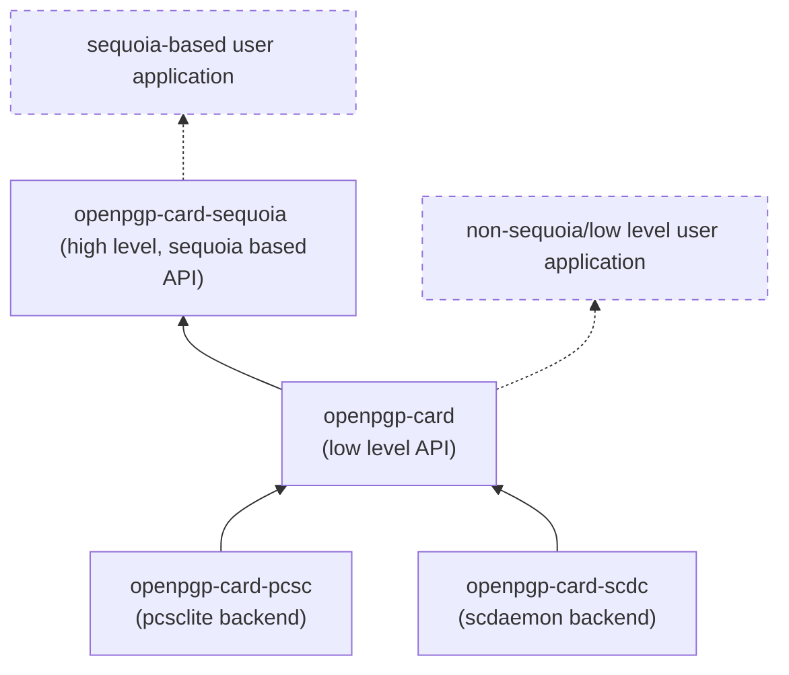

<!--
SPDX-FileCopyrightText: 2021 Heiko Schaefer <heiko@schaefer.name>
SPDX-License-Identifier: MIT OR Apache-2.0
-->

This project implements client software for the
[OpenPGP card](https://gnupg.org/ftp/specs/OpenPGP-smart-card-application-3.4.1.pdf)
standard, in Rust.

## Architecture

The project consists of the following crates:
- [openpgp-card](https://crates.io/crates/openpgp-card), which offers a
  relatively low level OpenPGP card client API.
  It is PGP implementation agnostic.
- [openpgp-card-pcsc](https://crates.io/crates/openpgp-card-pcsc),
  a backend to communicate with smartcards via
  [pcsc](https://pcsclite.apdu.fr/).
- [openpgp-card-scdc](https://crates.io/crates/openpgp-card-scdc),
  a backend to communicate with smartcards via an 
  [scdaemon](https://www.gnupg.org/documentation/manuals/gnupg/Invoking-SCDAEMON.html#Invoking-SCDAEMON)
  instance.
- [openpgp-card-sequoia](https://crates.io/crates/openpgp-card-sequoia),
  a higher level API for conveniently using openpgp-card with
  [Sequoia PGP](https://sequoia-pgp.org/).
- [openpgp-card-tests](https://gitlab.com/hkos/openpgp-card/-/tree/main/card-functionality),
  a testsuite to run OpenPGP card operations on smartcards.

### The openpgp-card crate

Implements the functionality described in the OpenPGP card specification, 
offering an API at roughly the level of abstraction of that specification,
using Rust data structures.
(However, this crate may work around some minor quirks of specific card 
models, in order to offer clients a somewhat uniform view)
This crate and its API do not depend or rely on an OpenPGP implementation.

### Backends

Implement:

- functionality to find and connect to a card (these 
operations may vary significantly between different backends), and

- a very simple communication primitive, by implementing the 
   `CardClient` trait:
sending individual APDU commands and receiving responses.

All higher level and/or OpenPGP card-specific logic (including command 
chaining) is handled in the `openpgp-card` layer.

### The **openpgp-card-sequoia** crate 

Offers a higher level interface, based around Sequoia PGP datastructures.

Most client projects will probably want to use only this crate, and 
ignore the lower level crates as implementation details.

## Acknowledgements

This project is based on the 
[OpenPGP Card spec](https://gnupg.org/ftp/specs/OpenPGP-smart-card-application-3.4.1.pdf),
version 3.4.1.

Other helpful resources included:
- The free [Gnuk](https://git.gniibe.org/cgit/gnuk/gnuk.git/)
  OpenPGP card implementation by [gniibe](https://www.gniibe.org/).
- The Rust/Sequoia-based OpenPGP card client code in
  [kushaldas](https://kushaldas.in/)' project
  [johnnycanencrypt](https://github.com/kushaldas/johnnycanencrypt/).
- The [scdaemon](https://git.gnupg.org/cgi-bin/gitweb.cgi?p=gnupg.git;a=tree;f=scd;hb=refs/heads/master)
  client implementation by the [GnuPG](https://gnupg.org/) project.
- The [open-keychain](https://github.com/open-keychain/open-keychain) project,
  which implements an OpenPGP card client for Java/Android.
- The Rust/Sequoia-based OpenPGP card client code by 
  [Robin Krahl](https://git.sr.ht/~ireas/sqsc).