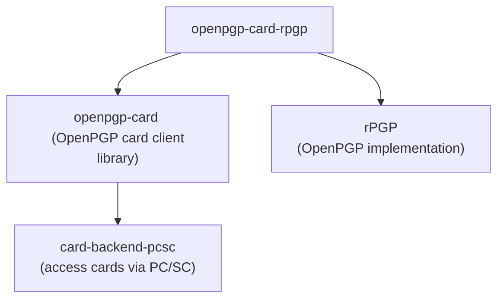

<!--
SPDX-FileCopyrightText: Heiko Schaefer <heiko@schaefer.name>
SPDX-License-Identifier: MIT OR Apache-2.0
-->

# OpenPGP card client library for use with rPGP

This crate implements OpenPGP card support for use with [rPGP](https://github.com/rpgp/rpgp/).

This is a convenience layer on top of the implementation-agnostic OpenPGP card client
library <https://crates.io/crates/openpgp-card>.

