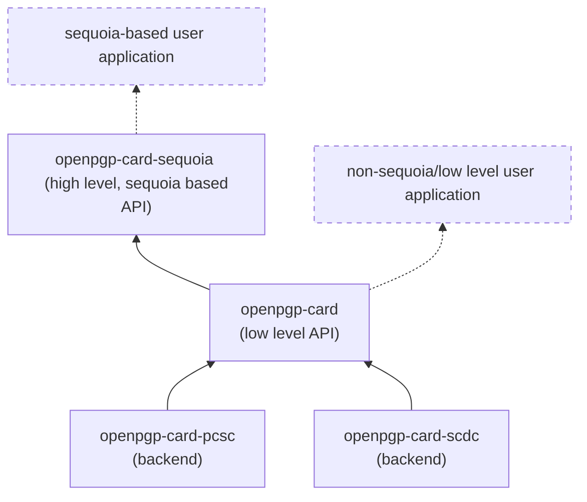

<!--
SPDX-FileCopyrightText: 2021 Heiko Schaefer <heiko@schaefer.name>
SPDX-License-Identifier: MIT OR Apache-2.0
-->

**OpenPGP card client library**

This project implements a client library for the
[OpenPGP card](https://gnupg.org/ftp/specs/OpenPGP-smart-card-application-3.4.1.pdf)
specification, in Rust.

The project consists of a number of crates:
- [openpgp-card](https://crates.io/crates/openpgp-card), which offers an 
  implementation-agnostic, relatively low level OpenPGP card client API.
  It is PGP implementation agnostic.
- [openpgp-card-sequoia](https://crates.io/crates/openpgp-card-sequoia),
  a higher level API for conveniently using openpgp-card with
  [Sequoia PGP](https://sequoia-pgp.org/).
- [openpgp-card-pcsc](https://crates.io/crates/openpgp-card-pcsc),
  a backend to communicate with smartcards via pcsc.
- [openpgp-card-scdc](https://gitlab.com/hkos/openpgp-card/-/tree/main/scdc),
  a backend to communicate with smartcards via an scdaemon instance.
- [openpgp-card-tests](https://gitlab.com/hkos/openpgp-card/-/tree/main/card-functionality),
  a testsuite to run OpenPGP card operations on smartcards.

**Architecture**

The backends implement very simple transport functionality. They can send 
APDU commands and receive responses. All OpenPGP card-specific logic, 
as well as command chaining are handled in `openpgp-card`.

**Acknowledgements**

This project is based on the 
[OpenPGP Card spec](https://gnupg.org/ftp/specs/OpenPGP-smart-card-application-3.4.1.pdf),
version 3.4.1.

Other helpful resources included:
- The free [Gnuk](https://git.gniibe.org/cgit/gnuk/gnuk.git/)
  OpenPGP card implementation by [gniibe](https://www.gniibe.org/).
- The Rust/Sequoia-based OpenPGP card client code in
  [kushaldas](https://kushaldas.in/)' project
  [johnnycanencrypt](https://github.com/kushaldas/johnnycanencrypt/).
- The [scdaemon](https://git.gnupg.org/cgi-bin/gitweb.cgi?p=gnupg.git;a=tree;f=scd;hb=refs/heads/master)
  client implementation by the [GnuPG](https://gnupg.org/) project.
- The [open-keychain](https://github.com/open-keychain/open-keychain) project,
  which implements an OpenPGP card client for Java/Android.
- The Rust/Sequoia-based OpenPGP card client code by 
  [Robin Krahl](https://git.sr.ht/~ireas/sqsc).