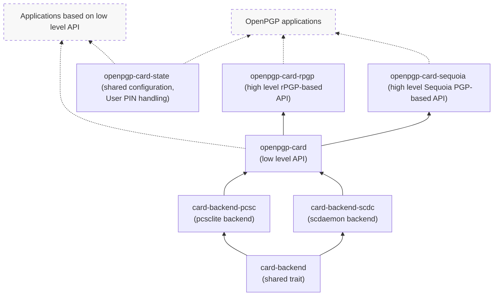

<!--
SPDX-FileCopyrightText: 2021-2023 Heiko Schaefer <heiko@schaefer.name>
SPDX-License-Identifier: MIT OR Apache-2.0
-->

# OpenPGP card client software in Rust

This project implements client software for the
[OpenPGP card](https://gnupg.org/ftp/specs/OpenPGP-smart-card-application-3.4.1.pdf)
standard, in Rust.

## Architecture

This project comprises the following library crates:

- [openpgp-card](https://crates.io/crates/openpgp-card), a low-level OpenPGP card client API.
  It is PGP implementation agnostic.
- [card-backend](https://crates.io/crates/card-backend), a shared trait for backends that perform raw communication with smart cards
- [card-backend-pcsc](https://crates.io/crates/card-backend-pcsc), a backend implementation to communicate with smart cards via [pcsc](https://pcsclite.apdu.fr/).
- [card-backend-scdc](https://crates.io/crates/card-backend-scdc), a backend implementation to communicate with smart cards via [scdaemon](https://www.gnupg.org/documentation/manuals/gnupg/Invoking-SCDAEMON.html#Invoking-SCDAEMON).
- [openpgp-card-rpgp](https://crates.io/crates/openpgp-card-rpgp), a companion crate for conveniently using openpgp-card with  [rPGP](https://github.com/rpgp/rpgp/).
- [openpgp-card-sequoia](https://crates.io/crates/openpgp-card-sequoia), a wrapping API for conveniently using openpgp-card with [Sequoia PGP](https://sequoia-pgp.org/).
- [openpgp-card-state](https://crates.io/crates/openpgp-card-state), shared infrastructure for handling card metadata and User PINs in applications.

This is how the libraries relate to each other (and to applications):

Additionally, the following non-library crates make use of the libraries described above:

- [openpgp-card-tools](https://crates.io/crates/openpgp-card-tools),
  the `oct` CLI tool to inspect, provision, configure and use OpenPGP cards, aimed at end users.
- [openpgp-card-ssh-agent](https://crates.io/crates/openpgp-card-ssh-agent), a simple standalone SSH Agent for OpenPGP cards
- [rsop](https://crates.io/crates/rsop), a "Stateless OpenPGP" CLI tool that can optionally use OpenPGP card devices to handle private key operations.

Finally, some tests and examples can be found in:

- [openpgp-card-tests](https://gitlab.com/openpgp-card/openpgp-card/-/tree/main/card-functionality),
  a test-suite that runs OpenPGP card operations on Smart Cards.
- [openpgp-card-examples](https://gitlab.com/openpgp-card/openpgp-card/-/tree/main/card-examples),
  small example applications that demonstrate how you can use these
  libraries in your own projects to access OpenPGP card functionality.

### The openpgp-card crate

Implements the functionality described in the OpenPGP card specification,
offering an API at roughly the level of abstraction of that specification,
using Rust data structures.
(However, this crate may work around some minor quirks of specific card
models, in order to offer clients a somewhat uniform view)

This crate and its API do not depend or rely on any particular OpenPGP
implementation.

### Backends

Typically, `openpgp-card` will be used with the `card-backend-pcsc` backend,
which uses the standard pcsc-lite library to communicate with cards.

However, alternative backends can be used and may be useful.  
The experimental, alternative `card-backend-scdc` backend uses scdaemon from
the GnuPG project as a low-level transport layer to interact with OpenPGP
cards.

Backends implement:

1) functionality to find and connect to a card (these operations may vary
   significantly between different backends),

2) transaction management (where applicable), by implementing the `CardBackend` trait, and

3) simple communication primitives, by implementing the `CardTransaction`
   trait, to send individual APDU commands and receive responses.

All higher level and/or OpenPGP card-specific logic (including command
chaining) is handled in the `openpgp-card` layer.

### The openpgp-card-rpgp crate

Wrapping functions to use the rPGP OpenPGP implementation with `openpgp-card`.

### The openpgp-card-sequoia crate

Offers a higher level interface, based around Sequoia PGP datastructures.

### Using this library from C

A small wrapper to use a subset of the `openpgp-card` Rust interface via a C API is offered by the external
project <https://github.com/wiktor-k/openpgp-card-ffi>. `openpgp-card-ffi` uses the Rust "Foreign Function Interface" (
FFI).

The subset of functionality in `openpgp-card-ffi` is aimed at applications that want to enumerate connected cards and
use their cryptographic signing and decryption facilities. It doesn't expose the functionality for detailed inspection
of card state or for provisioning cards.

## Testing

The subcrate `openpgp-card-tests` (in the directory `card-functionality`)
contains the beginnings of a framework that tests the `openpgp-card`
library against OpenPGP cards.

However, OpenPGP cards are, usually, physical devices that you plug into your
computer, e.g. as USB sticks, or Smart cards (this is, of course, the usual
point of these cards: they are independent devices, which are only loosely
coupled with your regular computing environment).
For automated testing, such as CI, this is a complication.

There are at least two approaches for running tests against software-based
OpenPGP cards:

### Virtual OpenPGP cards

A collection of OpenPGP card implementations can be run in CI environments (or locally) for testing purposes. The https://gitlab.com/openpgp-card/virtual-cards repository provides Container
images for a number of such OpenPGP card implementations, including simulated JavaCard applets such as the "SmartPGP" and "YubiKey NEO" implementations.

These virtual cards can be accessed via the [PCSC lite](https://pcsclite.apdu.fr/) framework, and used just like actual hardware OpenPGP cards.

These images are used to run the `card-functionality` tests in gitlab's CI. See the GitLab CI config
[openpgp-card/openpgp-card:.gitlab-ci.yml](https://gitlab.com/openpgp-card/openpgp-card/-/blob/main/.gitlab-ci.yml)
and the Dockerfiles and run script:
[openpgp-card/openpgp-card:card-functionality/docker/](https://gitlab.com/openpgp-card/openpgp-card/-/tree/main/card-functionality/docker/).

### Emulated Gnuk

Gnuk is a free implementation of the OpenPGP card spec by
[Gniibe](https://www.gniibe.org/), see: http://www.fsij.org/doc-gnuk/.

Gnuk normally runs on STM32-based hardware tokens. However, it's also
possible to compile the Gnuk code to run on your host machine. This is
useful for testing purposes.

Emulated Gnuk is connected to the system via http://usbip.sourceforge.net/.
This means that to use an emulated Gnuk, you need to have both root
privileges and be able to load a kernel module (so running an emulated
Gnuk is not currently possible in GitLab CI).

See
the [README](https://gitlab.com/openpgp-card/openpgp-card/-/tree/main/card-functionality#running-tests-against-emulated-gnuk-via-pcsc)
of the `card-functionality` project for more information on this.

## Acknowledgements

This project is based on the [OpenPGP card spec](https://gnupg.org/ftp/specs/OpenPGP-smart-card-application-3.4.1.pdf), version 3.4.1.

Other helpful resources included:

- The free [Gnuk](https://git.gniibe.org/cgit/gnuk/gnuk.git/) OpenPGP card implementation by [gniibe](https://www.gniibe.org/).
- The Rust/Sequoia-based OpenPGP card client code in
  [kushaldas](https://kushaldas.in/)' project
  [johnnycanencrypt](https://github.com/kushaldas/johnnycanencrypt/).
- The [scdaemon](https://git.gnupg.org/cgi-bin/gitweb.cgi?p=gnupg.git;a=tree;f=scd;hb=refs/heads/master)
  client implementation by the [GnuPG](https://gnupg.org/) project.
- The [open-keychain](https://github.com/open-keychain/open-keychain) project,
  which implements an OpenPGP card client for Java/Android.
- The Rust/Sequoia-based OpenPGP card client code by
  [Robin Krahl](https://git.sr.ht/~ireas/sqsc).

# Funding

This project has been funded in part through [NGI Assure](https://nlnet.nl/assure), a fund established
by [NLnet](https://nlnet.nl) with financial support from the European
Commission's [Next Generation Internet](https://ngi.eu) program.

Learn more at the [NLnet project page](https://nlnet.nl/OpenPGPCA-HSM).