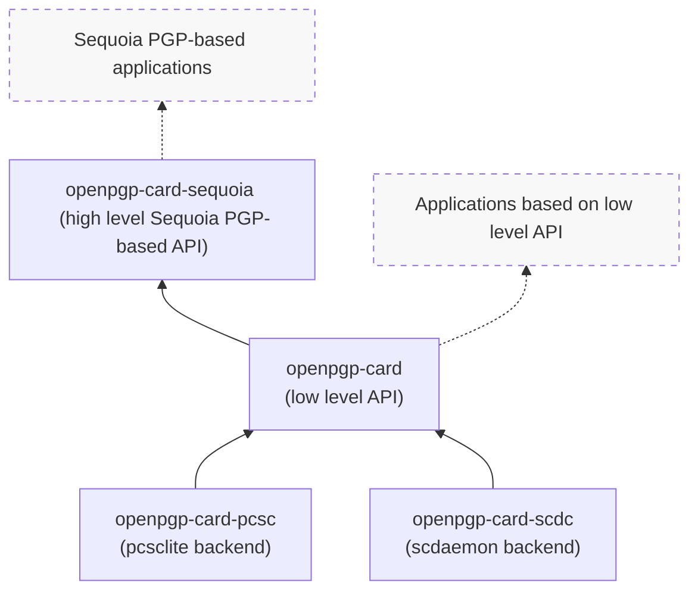

<!--
SPDX-FileCopyrightText: 2021 Heiko Schaefer <heiko@schaefer.name>
SPDX-License-Identifier: MIT OR Apache-2.0
-->

This project implements client software for the
[OpenPGP card](https://gnupg.org/ftp/specs/OpenPGP-smart-card-application-3.4.1.pdf)
standard, in Rust.

## Architecture

This project consists of the following library crates:

- [openpgp-card](https://crates.io/crates/openpgp-card), which offers a
  relatively low level OpenPGP card client API.
  It is PGP implementation agnostic.
- [openpgp-card-pcsc](https://crates.io/crates/openpgp-card-pcsc),
  a backend to communicate with smartcards via
  [pcsc](https://pcsclite.apdu.fr/).
- [openpgp-card-scdc](https://crates.io/crates/openpgp-card-scdc),
  a backend to communicate with smartcards via an 
  [scdaemon](https://www.gnupg.org/documentation/manuals/gnupg/Invoking-SCDAEMON.html#Invoking-SCDAEMON)
  instance.
- [openpgp-card-sequoia](https://crates.io/crates/openpgp-card-sequoia),
  a higher level API for conveniently using openpgp-card with
  [Sequoia PGP](https://sequoia-pgp.org/).

This is how the libraries relate to each other (and to applications):

Additionally, there are the following non-library crates that are built on 
top of the libraries described above:

- [openpgp-card-tools](https://crates.io/crates/openpgp-card-sequoia),
  two CLI tools aimed at end users, to manage and use OpenPGP cards.
- [openpgp-card-tests](https://gitlab.com/hkos/openpgp-card/-/tree/main/card-functionality),
  a test-suite that runs OpenPGP card operations on smartcards.
- [openpgp-card-examples](https://gitlab.com/hkos/openpgp-card/-/tree/main/card-examples),
  small example applications that demonstrate how you can use these 
  libraries in your own projects to access OpenPGP card functionality.

### The openpgp-card crate

Implements the functionality described in the OpenPGP card specification, 
offering an API at roughly the level of abstraction of that specification,
using Rust data structures.
(However, this crate may work around some minor quirks of specific card 
models, in order to offer clients a somewhat uniform view)

This crate and its API do not depend or rely on any particular OpenPGP 
implementation.

### Backends

Typically, `openpgp-card` will be used with the `openpgp-card-pcsc` backend,
which uses the standard pcsclite library to communicate with cards.
However, alternative backends can be used and may be useful.  
The experimental, alternative `openpgp-card-scdc` backend uses scdaemon from 
the GnuPG project as a low-level transport layer to interact with OpenPGP 
cards.

Backends implement:

1) functionality to find and connect to a card (these operations may vary 
   significantly between different backends), and

2) a very simple communication primitive, by implementing the `CardClient` 
   trait, to send individual APDU commands and receive responses.

All higher level and/or OpenPGP card-specific logic (including command 
chaining) is handled in the `openpgp-card` layer.

### The **openpgp-card-sequoia** crate 

Offers a higher level interface, based around Sequoia PGP datastructures.

Most client projects will probably want to use only this crate, and 
ignore the lower level crates as implementation details.

## Testing

The subcrate `openpgp-card-tests` (in the directory `card-functionality`) 
contains the beginnings of a framework that tests the `openpgp-card` 
library against OpenPGP cards.

However, OpenPGP cards are, usually, physical devices that you plug into your 
computer, e.g. as USB sticks, or Smart cards (this is, of course, the usual 
point of these cards: they are independent devices, which are only loosely 
coupled with your regular computing environment. However, for automated 
testing, such as CI, this can be a complication.)

There are at least two approaches for running tests against software-based 
OpenPGP cards:

### Virtual JavaCards

It's possible to run simulated JavaCard applets on a host computer, and 
make those available via the [PCSC lite](https://pcsclite.apdu.fr/) framework.

To simplify testing against such simulated cards, the
https://gitlab.com/hkos/openpgp-card-images repository provides Container 
images for the "SmartPGP" and "YubiKey NEO" OpenPGP card implementations.

These images are used to run card-functionality tests on gitlab's CI.
See the GitLab CI config
[hkos/openpgp-card:.gitlab-ci.yml](https://gitlab.com/hkos/openpgp-card/-/blob/main/.gitlab-ci.yml)
and the Dockerfiles and run script:
[hkos/openpgp-card:card-functionality/docker/](https://gitlab.com/hkos/openpgp-card/-/tree/main/card-functionality/docker/).

### Emulated Gnuk

Gnuk is a free implementation of the OpenPGP card spec by
[Gniibe](https://www.gniibe.org/), see: http://www.fsij.org/doc-gnuk/.

Gnuk normally runs on STM32-based hardware tokens. However, it's also 
possible to compile the Gnuk code to run on your host machine. This is 
useful for testing purposes.

Emulated Gnuk is connected to the system via http://usbip.sourceforge.net/.
This means that to use an emulated Gnuk, you need to have both root 
privileges and be able to load a kernel module (so running an emulated 
Gnuk is not currently possible in GitLab CI).

See the [README](https://gitlab.com/hkos/openpgp-card/-/tree/main/card-functionality#running-tests-against-emulated-gnuk-via-pcsc)
of the `card-functionality` project for more information on this.

## Acknowledgements

This project is based on the 
[OpenPGP card spec](https://gnupg.org/ftp/specs/OpenPGP-smart-card-application-3.4.1.pdf),
version 3.4.1.

Other helpful resources included:
- The free [Gnuk](https://git.gniibe.org/cgit/gnuk/gnuk.git/)
  OpenPGP card implementation by [gniibe](https://www.gniibe.org/).
- The Rust/Sequoia-based OpenPGP card client code in
  [kushaldas](https://kushaldas.in/)' project
  [johnnycanencrypt](https://github.com/kushaldas/johnnycanencrypt/).
- The [scdaemon](https://git.gnupg.org/cgi-bin/gitweb.cgi?p=gnupg.git;a=tree;f=scd;hb=refs/heads/master)
  client implementation by the [GnuPG](https://gnupg.org/) project.
- The [open-keychain](https://github.com/open-keychain/open-keychain) project,
  which implements an OpenPGP card client for Java/Android.
- The Rust/Sequoia-based OpenPGP card client code by 
  [Robin Krahl](https://git.sr.ht/~ireas/sqsc).